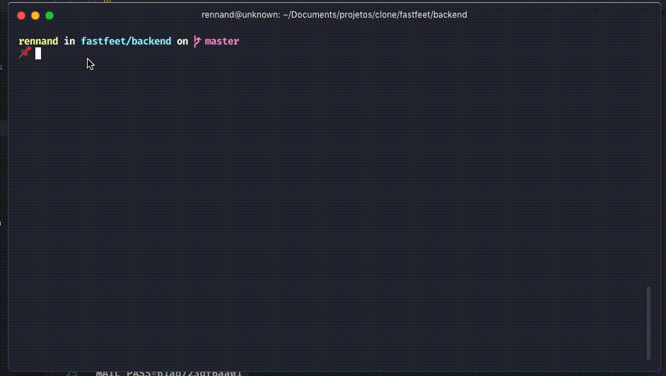
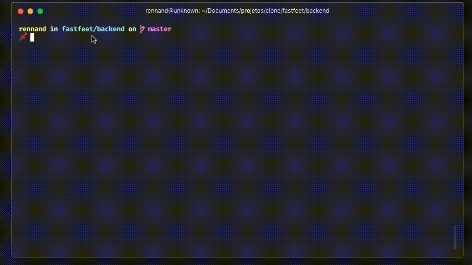

<h1 align="center">
    
</h1>

<h2 align="center">
    FastFeet, The future of parcel deliveries! 📫 🚚💨
</h2>

<h3 align="center">
    Your order treated with great affection. 💌
</h3>

# Cloning this project

```
$ git clone https://github.com/RennanD/fastfeet.git
```

# ❗️ Requisites

To runed this all project, you need have be the packages installed:

- [Node.js](https://nodejs.org/en/)
- [Yarn](https://legacy.yarnpkg.com/en/) (Optional).

# 💾 Backend

- API RESTFUL created with Node.js using [express](https://expressjs.com/pt-br/).

- For database use PostgresSQL with [sequelize](https://sequelize.org/v5/).

## ⚡️ Start

- For use this api you need have be installed PostgresSQL, I'm use [Docker](https://www.docker.com/), but this is optional.
- If you don't want installing DOCKER, use convencional [Postgres](https://www.postgresql.org/download/) installation.

### Runing Postgres using DOCKER: 🐋

- In your terminal, run this commands:

```
$ docker run --name some-postgres -e POSTGRES_PASSWORD=mysecretpassword -d postgres
```

#### If you already have a container with Postgres, run:

```
$ docker start "CONTAINER DOCKER ID"
```

- For background jobs I'm using Redis with DOCKER.
- If you don't want installing DOCKER, use convencional installation of [Redis](https://chocolatey.org/packages/redis-64) via [Chocolatey](https://chocolatey.org/docs/installation) .

### Runing Redis using DOCKER: 🐋

```
$ docker run --name some-redis -d redis
```

#### If you already have a container with Rerdis, run:

```
$ docker start "CONTAINER DOCKER ID"
```

### Environments varibles:

- in backend root, add a .env file;
- Fill in the .env file based on the [.env.example](https://github.com/RennanD/fastfeet/blob/master/backend/.env.example) file;

#### Demo

<h1 align="center">
    
</h1>

### Now in your terminal:

- To init Fastfeet database, navigate to your project folder and run:

```
$ cd backend

$ yarn

$ yarn sequelize db:create

$ yarn sequelize db:migrate

$ yarn sequelize db:seed:all

```

#### Demo

<h1 align="center">
    
</h1>

- To init Fastfeet server, run:

```
$ yarn dev
```

- Open new tab in your terminal and run:

```
$ yarn queue
```

#### Demo

<h1 align="center">
    
</h1>

#### To debugin, run:

```
yarn dev:debug
```
