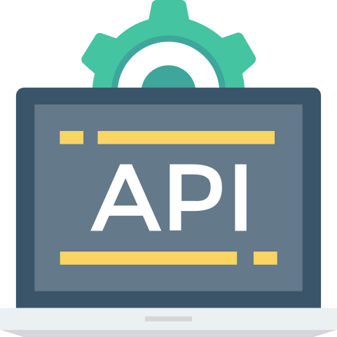
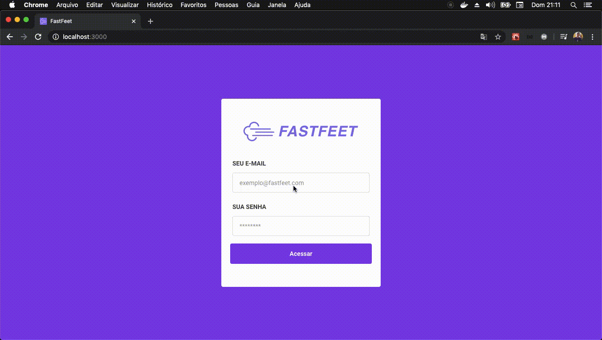

<h1 align="center">
    
</h1>

<h2 align="center">
    FastFeet, The future of parcel deliveries! 📫 🚚💨
</h2>

<h3 align="center">
    Your order treated with great affection. 💌
</h3>

# Cloning this project

```
$ git clone https://github.com/RennanD/fastfeet.git
```

#### Demo

<h1 align="center">
    
</h1>

# ❗️ Requisites

To runed this all project, you need have be the packages installed:

- [Node.js](https://nodejs.org/en/)
- [Yarn](https://legacy.yarnpkg.com/en/) (Optional).

# 💾 Backend

<h1 align="center">
    
</h1>

- API RESTFUL created with Node.js using [express](https://expressjs.com/pt-br/).

- For database use PostgresSQL with [sequelize](https://sequelize.org/v5/).

## ⚡️ Start

- For use this api you need have be installed PostgresSQL, I'm use [Docker](https://www.docker.com/), but this is optional.
- If you don't want installing DOCKER, use convencional [Postgres](https://www.postgresql.org/download/) installation.

### Runing Postgres using DOCKER: 🐋

- In your terminal, run this commands:

```
$ docker run --name some-postgres -e POSTGRES_PASSWORD=mysecretpassword -d postgres
```

#### If you already have a container with Postgres, run:

```
$ docker start "CONTAINER DOCKER ID"
```

- For background jobs I'm using Redis with DOCKER.
- If you don't want installing DOCKER, use convencional installation of [Redis](https://chocolatey.org/packages/redis-64) via package maneger.

-- For windows: [Chocolatey](https://chocolatey.org/docs/installation)
-- For MacOs: Brew
-- For linux (Ubuntu/Debian): [Apt](https://www.hostinger.com.br/tutoriais/install-redis-ubuntu/)

### Runing Redis using DOCKER: 🐋

```
$ docker run --name some-redis -d redis
```

#### If you already have a container with Rerdis, run:

```
$ docker start "CONTAINER DOCKER ID"
```

### Environments varibles:

- in backend root, add a .env file;
- Fill in the .env file based on the [.env.example](https://github.com/RennanD/fastfeet/blob/master/backend/.env.example) file;

#### Demo

<h1 align="center">
    
</h1>

### Now in your terminal:

- To init Fastfeet database, navigate to your project folder and run:

```
$ cd backend

$ yarn

$ yarn sequelize db:create

$ yarn sequelize db:migrate

$ yarn sequelize db:seed:all

```

#### Demo

<h1 align="center">
    
</h1>

- To init Fastfeet server, run:

```
$ yarn dev
```

- Open new tab in your terminal, navigate to the project/backend folder and run:

```
$ yarn queue
```

#### Demo

<h1 align="center">
    
</h1>

#### To debugin, run:

```
yarn dev:debug
```

# 🖥 Frontend web

<h1 align="center">
    
</h1>

## ⚡️ Start web application

- In your terminal, open new tab, navigate to project/frontend folder and run:

```
$ yarn
$ yarn start
```

<h1 align="center">
    
</h1>

- In the services/api.js file, place the host your backend is running on, for example: http://localhost.:3333

## 🚚💜 The Web app

- To login as admin in web admin aplication, use this credencials

```
E-mail: admin@fastefeet.com.br
Password: 123456
```

<h1 align="center">
    
</h1>

### Application gif demo

<h1 align="center">
    
</h1>

# 📱💜 The app mobile

<h1 align="center">
    
</h1>

## ⚡️ Start mobile application

- Use the [react-native-cli](https://www.npmjs.com/package/react-native-cli) to run this app.

- In the services/api.js file, place the host your backend is running on, for example: http://localhost.:3333

- In your terminal, open new tab, navigate to project/mobile folder and run:

```
$ yarn
```

<h1 align="center">
    
</h1>

### 🍎 IOS

- Runing this app in IOS devices.

#### ❗️ Requisites:

- You need have been installed the [XCode](https://developer.apple.com/xcode/)

```
$ cd ios
$ pod install
$ cd ..
$ react-native run-ios
```

### 👾 Android

- Runing this app in Android devices.

#### ❗️ Requisites:

- You need have been installed the [Android SDK](https://developer.android.com/studio)

```
$ adb reverse tcp:3333 tcp:3333
$ react-native run-android
```

- Obs.: change tcp:3333 for your backend port.

<h1 align="center">
    
</h1>

### Login

- sign in aplcations as deliveryman, you use your ID (Deliveryman ID).

<h1 align="center">
    
</h1>

### Application gif demo

<h1 align="center">
    
</h1>
